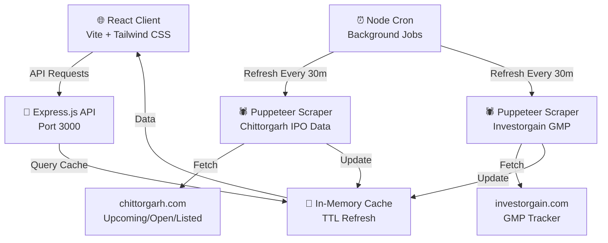
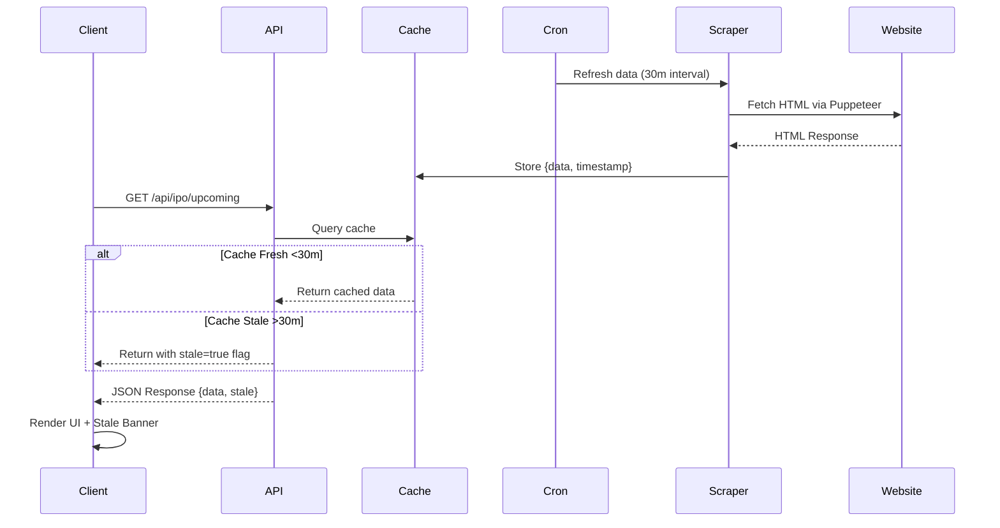
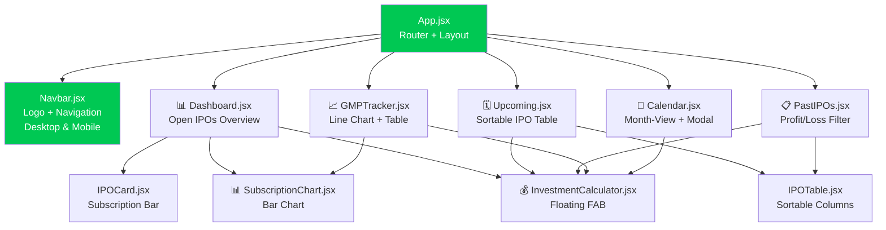
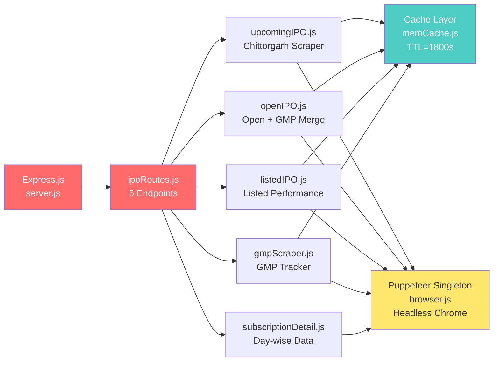
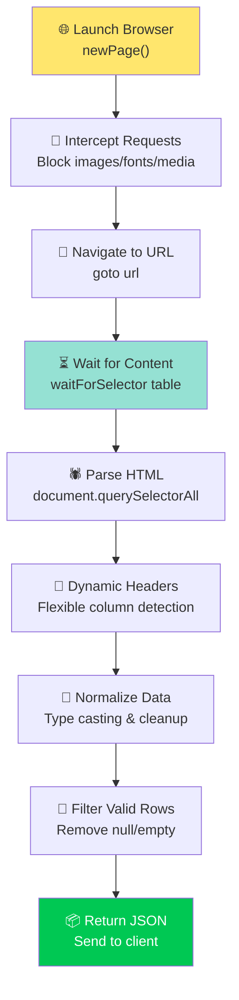

# IPOTrack — Real-time Indian IPO Tracker

[](LICENSE)
[](https://nodejs.org)
[](https://react.dev)
[](https://vitejs.dev)

<div align="center">
  
  <p><strong>Track Indian IPOs in real-time</strong></p>
  <p>Monitor upcoming, open, and listed IPO data with live GMP tracking, subscription charts, and investment calculations.</p>
</div>

---

## 🚀 Features

### Core IPO Tracking
- **📊 Dashboard** — Real-time overview of open IPOs with subscription status
- **🗓️ Upcoming IPOs** — Upcoming IPO listings with dates and price bands
- **📅 Calendar View** — Month-view IPO calendar with modal details
- **📈 GMP Tracker** — Live Gray Market Premium tracking with historical trends
- **📋 Past IPOs** — Listed IPO performance with profit/loss filtering

### Advanced Features
- **💰 Investment Calculator** — Floating FAB calculator for IPO investment scenarios
- **📊 Subscription Charts** — Day-wise subscription data visualization
- **⚡ Real-time Updates** — In-memory caching with TTL-based background refresh
- **📱 Responsive Design** — Mobile-first UI with Tailwind CSS
- **🎨 Dark-first Theme** — Modern dark theme with green accent color (#00C853)

### Data Sources
- **Chittorgarh.com** — Puppeteer-based web scraping for IPO data
- **Investorgain.com** — GMP and listing data aggregation
- **Automated Refresh** — Cron-based data sync every 30 minutes

---

## 📋 Table of Contents

- [Architecture](#-architecture)
- [Tech Stack](#-tech-stack)
- [Quick Start](#-quick-start)
- [Project Structure](#-project-structure)
- [API Endpoints](#-api-endpoints)
- [Deployment](#-deployment)
- [Development](#-development)
- [Troubleshooting](#-troubleshooting)

---

## 🏗️ Architecture

### System Overview



### Data Flow & Caching



### Frontend Component Architecture



### Backend API & Scraper Architecture



### Puppeteer Scraper Workflow



---

## 🛠️ Tech Stack

### Frontend
- **React 18** — Component-based UI library
- **Vite 5** — Lightning-fast build tool & dev server
- **Tailwind CSS 3** — Utility-first CSS framework
- **React Router v6** — Client-side routing
- **Axios** — Promise-based HTTP client
- **Chart.js** — Interactive data visualization
- **date-fns** — Modern date utilities

### Backend
- **Node.js 20+** — JavaScript runtime
- **Express.js 4** — Minimal web framework
- **Puppeteer** — Headless browser automation
- **node-cron** — Cron-based job scheduler
- **CORS** — Cross-origin resource sharing middleware

### Deployment
- **Vercel** — Full-stack serverless hosting
- **Environment Variables** — Runtime configuration
- **Build Optimization** — Code splitting & minification

---


---

## 💻 Development

### Local Development Setup

```bash
# Install all dependencies
npm install --prefix frontend
npm install --prefix backend

# Terminal 1: Backend dev server (auto-reload with nodemon)
cd backend
npm run dev

# Terminal 2: Frontend dev server with HMR
cd frontend
npm run dev

# Open http://localhost:5173 in browser
```

### Building for Production

```bash
# Build frontend (outputs to frontend/dist/)
cd frontend
npm run build

# Backend is ready as-is for Vercel deployment
# Just ensure package.json includes all dependencies
```

### Testing API Endpoints

**Using curl:**
```bash
curl http://localhost:3000/api/ipo/upcoming
curl http://localhost:3000/api/ipo/open
curl http://localhost:3000/api/ipo/listed
curl http://localhost:3000/api/ipo/gmp
```

**Using VS Code REST Client:**

Create `test.http` in the root:
```http
### Upcoming IPOs
GET http://localhost:3000/api/ipo/upcoming

### Open IPOs
GET http://localhost:3000/api/ipo/open

### Listed IPOs
GET http://localhost:3000/api/ipo/listed

### GMP Data
GET http://localhost:3000/api/ipo/gmp
```

---

Common issues:
- Missing dependencies → Run `npm install --prefix backend`
- Build script errors → Check `backend/package.json` scripts
- Environment variables → Add to Vercel dashboard
- Port conflicts → Ensure no hardcoded ports in backend

---

## 📄 License

This project is licensed under the **MIT License** — see [LICENSE](LICENSE) file for details.


**Made with ❤️ by the urayushjain Team**


