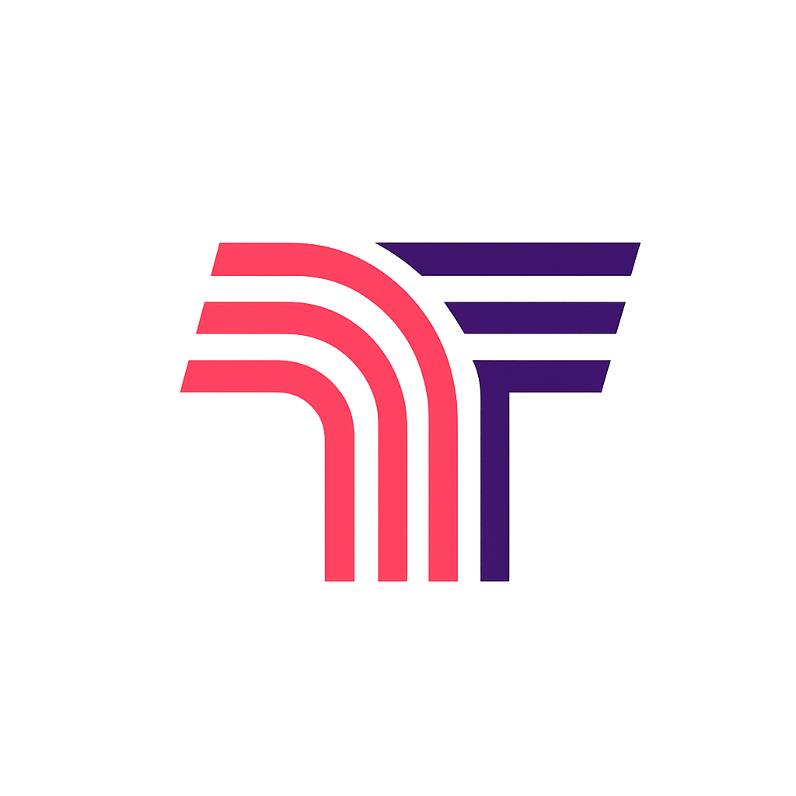
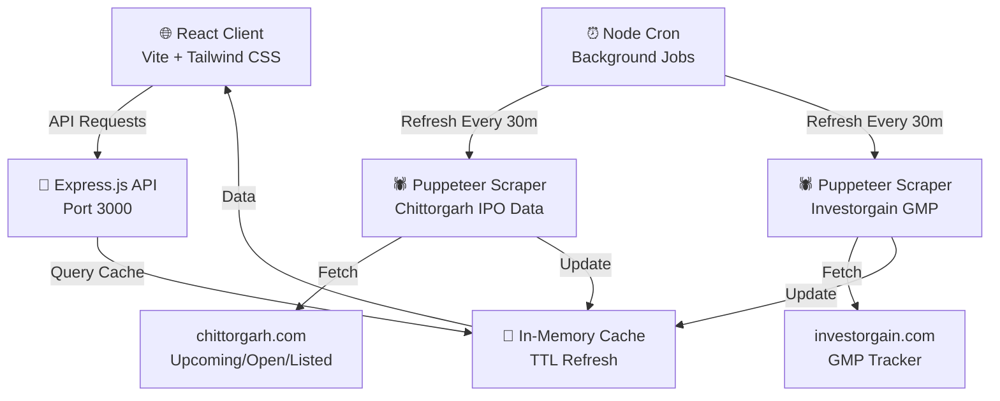
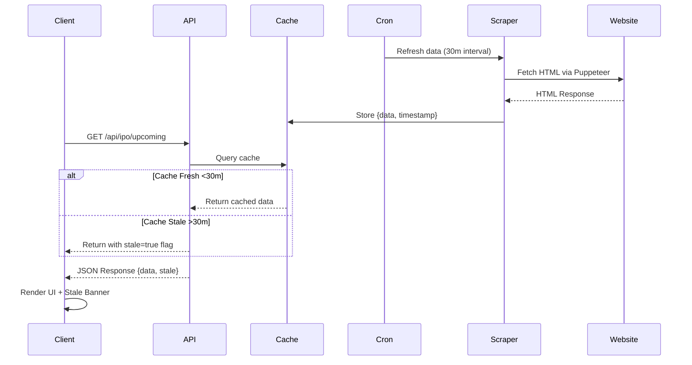
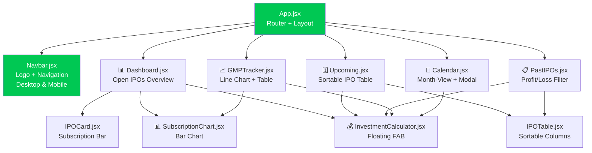
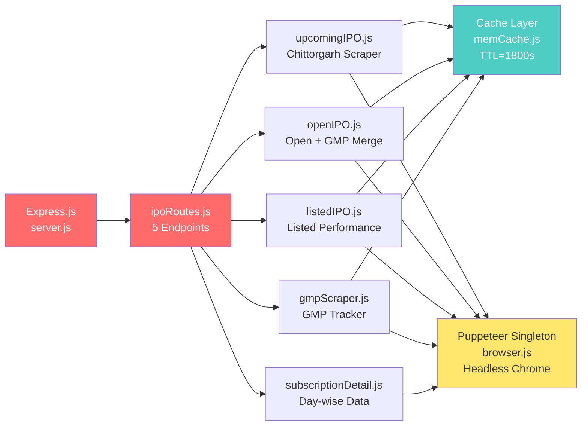
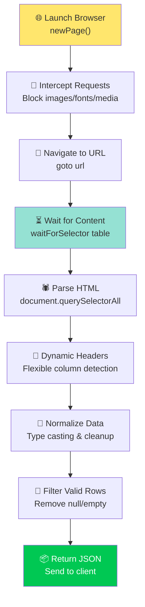

# IPOTrack — Real-time Indian IPO Tracker

<div align="center">
  
  <p><strong>Track Indian IPOs in real-time</strong></p>
  <p>Monitor upcoming, open, and listed IPO data with live GMP tracking, subscription charts, and investment calculations.</p>
</div>

---

## 🚀 Features

### Core IPO Tracking
- **📊 Dashboard** — Real-time overview of open IPOs with subscription status
- **🗓️ Upcoming IPOs** — Upcoming IPO listings with dates and price bands
- **📅 Calendar View** — Month-view IPO calendar with modal details
- **📈 GMP Tracker** — Live Gray Market Premium tracking with historical trends
- **📋 Past IPOs** — Listed IPO performance with profit/loss filtering

### Advanced Features
- **💰 Investment Calculator** — Floating FAB calculator for IPO investment scenarios
- **📊 Subscription Charts** — Day-wise subscription data visualization
- **⚡ Real-time Updates** — In-memory caching with TTL-based background refresh
- **📱 Responsive Design** — Mobile-first UI with Tailwind CSS
- **🎨 Dark-first Theme** — Modern dark theme with green accent color (#00C853)

---

## 📋 Table of Contents

- [Features](#-features)
- [Architecture & Approach](#-architecture--approach)
- [Tech Stack](#-tech-stack)
- [Local Setup (Quick Start)](#-local-setup-quick-start)
- [Deployment](#-deployment)
- [License](#-license)

---

## 🏗️ Architecture & Approach

This project is built using a **Split Hosting Architecture** to overcome serverless limitations. Web scraping with headless Chrome (Puppeteer) requires persistent memory and longer execution times than what free serverless platforms (like Vercel) allow.

To solve this, we split the application into two optimized environments:

1. **The Backend (Railway.app):** A continuous Node.js/Express server. It runs background cron jobs every hour that launch a hidden Google Chrome browser. It scrapes live IPO data from Chittorgarh and Investorgain, processes it, and stores it in lightning-fast RAM (In-Memory Cache).
2. **The Frontend (Vercel):** A blazing fast React Single Page Application (SPA). Because all the heavy scraping is already done by the backend, the frontend receives the data instantly via API calls. 

### System Overview



### Data Flow & Caching



### Frontend Component Architecture



### Backend API & Scraper Architecture



### Puppeteer Scraper Workflow



---

## 🛠️ Tech Stack

### Frontend
- **React 18** — Component-based UI library
- **Vite 5** — Lightning-fast build tool & dev server
- **Tailwind CSS 3** — Utility-first CSS framework
- **React Router v6** — Client-side routing
- **Axios** — Promise-based HTTP client
- **Chart.js** — Interactive data visualization
- **date-fns** — Modern date utilities

### Backend
- **Node.js 20+** — JavaScript runtime
- **Express.js 4** — Minimal web framework
- **Puppeteer** — Headless browser automation
- **node-cron** — Cron-based job scheduler
- **CORS** — Cross-origin resource sharing middleware

### Deployment
- **Railway.app** — Backend Node.js server with continuous memory
- **Vercel** — Fast frontend CDN and hosting
- **Environment Variables** — Cross-origin configuration

---

## 💻 Local Setup (Quick Start)

Because of the built-in Vite proxy and automated root scripts, running this app locally on your laptop is incredibly simple. You don't need to configure any environment variables or set up Chrome!

**Step 1: Clone the repository**
```bash
git clone https://github.com/URAYUSHJAIN/IPOTrack.git
cd IPOTrack
```

**Step 2: Install all dependencies**
```bash
npm run install-all
```
*(This automatically installs everything for the root, frontend, and backend folders at once. It also automatically downloads the required headless Chrome browser).*

**Step 3: Start both servers**
```bash
npm run dev
```
*(This starts the backend on port 3000 and the frontend on port 5173 simultaneously. The frontend automatically proxies `/api` requests to the backend).*

**Step 4: Open in Browser**
Go to `http://localhost:5173` in your browser. The first load may take ~15 seconds as the scraper initializes, but subsequent loads will be instant.

---

## 🚀 Deployment

This app requires **Split Hosting** (Railway + Vercel):

1. **Backend:** Deploy the root repository to **Railway.app**. Set the "Root Directory" in Railway settings to `/backend`. Generate a public service domain (e.g., `https://ipotrack-production.up.railway.app`).
2. **Frontend:** Deploy the root repository to **Vercel.com**. Set the "Root Directory" to `frontend`. Add an environment variable named `VITE_API_URL` and paste your Railway public domain into it.

---

## 📄 License

This project is licensed under the **MIT License** — see [LICENSE](LICENSE) file for details.

**Made with ❤️ by urayushjain**
